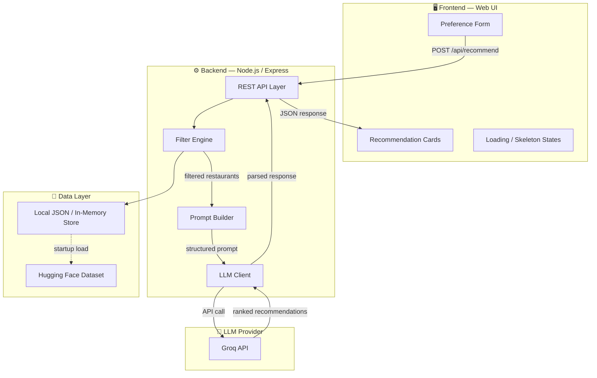
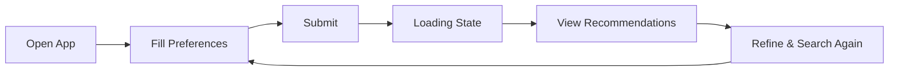
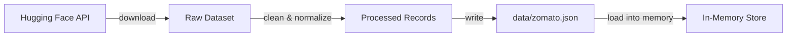
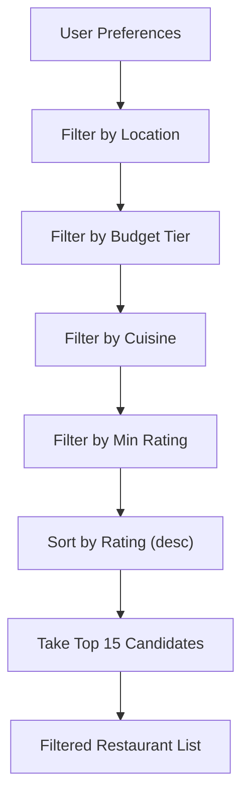
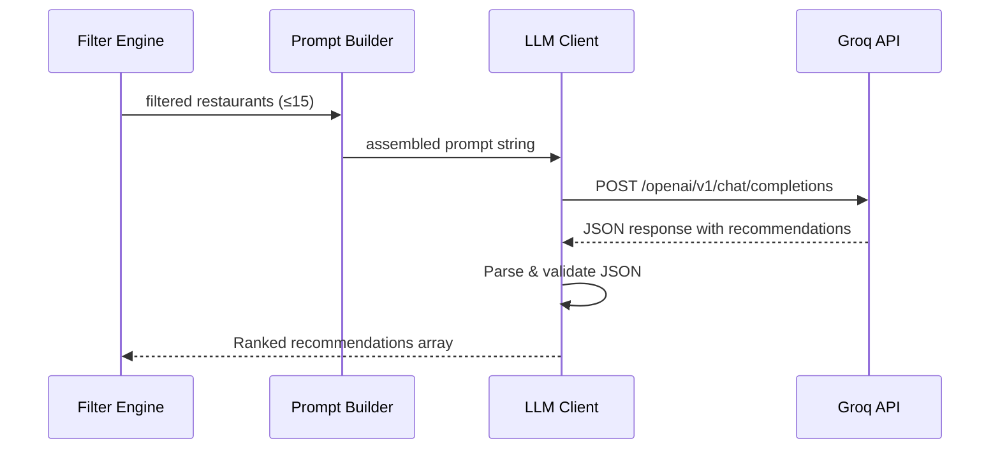
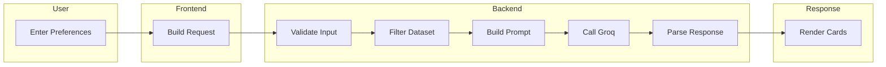

# Architecture: AI-Powered Restaurant Recommendation System (Zomato)

> **Reference:** [context.md](file:///Users/shree/Desktop/Next%20Leap%20Prodman/Google%20Antigravity/Zomato%20Project/context.md)

---

## 1. High-Level Architecture



---

## 2. Component Breakdown

### 2.1 Frontend (Web UI)

| Aspect | Detail |
|---|---|
| **Tech** | Next.js (App Router) + TypeScript + Tailwind CSS |
| **Design** | Dark-themed, glassmorphism cards, micro-animations, shimmer skeletons |
| **Pages** | Single-page app with preference form → results view |
| **Responsiveness** | Mobile-first, responsive grid for recommendation cards |
| **Port** | `3001` (dev), proxies `/api/*` to Express on `3000` |

**Key UI Components:**

```
frontend/
├── app/
│   ├── layout.tsx            # Root layout — fonts (Inter), metadata, SEO
│   ├── page.tsx              # Home page — hero + form + results
│   └── globals.css           # Tailwind base + custom CSS (glassmorphism, animations)
├── components/
│   ├── Header.tsx            # Scroll-reactive glassmorphism header
│   ├── PreferenceForm.tsx    # Form with validation + budget toggles + rating slider
│   ├── RecommendationCard.tsx # Glassmorphism card with rank, rating, AI explanation
│   ├── CardGrid.tsx          # Responsive grid with staggered entry
│   ├── LoadingSkeleton.tsx   # Shimmer skeleton matching card layout
│   ├── ErrorState.tsx        # Error display with retry
│   ├── EmptyState.tsx        # Illustration before first search
│   └── Footer.tsx            # Footer with credits
├── lib/
│   ├── api.ts                # Fetch wrapper — POST /api/recommend
│   └── types.ts              # TypeScript interfaces for API contract
├── hooks/
│   └── useRecommendations.ts # Custom hook — loading, data, error states
└── next.config.ts            # API proxy rewrites to Express backend
```

**User Flow:**



---

### 2.2 Backend (API Server)

| Aspect | Detail |
|---|---|
| **Tech** | Node.js + Express |
| **API Style** | RESTful JSON |
| **Port** | `3000` (dev) |

**Directory Structure:**

```
backend/
├── server.js             # Express app setup, route mounting
├── routes/
│   └── recommend.js      # POST /api/recommend endpoint
├── services/
│   ├── dataLoader.js     # Load & cache Zomato dataset
│   ├── filterEngine.js   # Filter restaurants by user preferences
│   ├── promptBuilder.js  # Build structured LLM prompt
│   └── llmClient.js      # Call Groq API, parse response
├── utils/
│   └── validators.js     # Input sanitization & validation
├── data/
│   └── zomato.json       # Cached dataset (generated at startup)
├── .env                  # API keys (GROQ_API_KEY)
└── package.json
```

---

### 2.3 Data Layer

#### Dataset Source

| Field | Value |
|---|---|
| **Source** | [ManikaSaini/zomato-restaurant-recommendation](https://huggingface.co/datasets/ManikaSaini/zomato-restaurant-recommendation) |
| **Format** | CSV / Parquet via Hugging Face Datasets |
| **Storage** | Downloaded once → cached as local JSON |

#### Data Schema (Expected Fields)

| Column | Type | Description |
|---|---|---|
| `name` | String | Restaurant name |
| `location` / `city` | String | City or locality |
| `cuisines` | String | Comma-separated cuisine types |
| `average_cost_for_two` | Number | Cost for two people (INR) |
| `aggregate_rating` | Number | Rating out of 5 |
| `votes` | Number | Total user votes |
| `has_online_delivery` | Boolean | Online delivery availability |
| `has_table_booking` | Boolean | Table booking availability |

#### Data Processing Pipeline



**Processing Steps:**

1. **Download** — Fetch dataset from Hugging Face (one-time)
2. **Clean** — Handle missing values, normalize strings (lowercase cities, trim whitespace)
3. **Normalize cost** — Map `average_cost_for_two` into budget tiers: `Low` (≤₹500), `Medium` (₹500–₹1500), `High` (>₹1500)
4. **Parse cuisines** — Split comma-separated cuisine strings into arrays
5. **Index** — Store in memory keyed by city for fast lookup

---

### 2.4 Filter Engine

Filters the in-memory dataset based on user preferences **before** sending to the LLM (to keep prompts concise and costs low).



| Filter | Logic |
|---|---|
| **Location** | Case-insensitive match on `city` / `location` |
| **Budget** | Map user selection to cost ranges, filter accordingly |
| **Cuisine** | Partial match — any cuisine in the restaurant's list matches |
| **Min Rating** | `aggregate_rating >= user_min_rating` |
| **Cap** | Return top 15 by rating to keep LLM prompt under token limits |

---

### 2.5 Prompt Builder

Constructs a structured prompt that provides the LLM with context, instructions, and data.

**Prompt Template:**

```
You are an expert restaurant recommendation assistant.

A user is looking for restaurants with the following preferences:
- Location: {location}
- Budget: {budget}
- Cuisine: {cuisine}
- Minimum Rating: {min_rating}
- Additional Preferences: {additional_preferences}

Here are the top candidate restaurants that match their criteria:

{formatted_restaurant_list}

Based on the user's preferences, please:
1. Rank the top 5 restaurants from best to worst fit.
2. For each restaurant, explain WHY it is a good match.
3. Mention any trade-offs (e.g., higher cost but exceptional rating).

Respond in valid JSON format:
[
  {
    "rank": 1,
    "name": "...",
    "cuisine": "...",
    "rating": ...,
    "estimated_cost": ...,
    "explanation": "..."
  }
]
```

---

### 2.6 LLM Integration (Groq API)

| Aspect | Detail |
|---|---|
| **Provider** | Groq |
| **Model** | `llama-3.3-70b-versatile` (fast inference, cost-effective) |
| **Auth** | API key via `GROQ_API_KEY` env variable |
| **Output** | Structured JSON (parsed from response) |
| **Fallback** | If LLM fails, return filtered list without AI explanations |

**Request Flow:**



---

## 3. API Contract

### `POST /api/recommend`

**Request Body:**

```json
{
  "location": "Delhi",
  "budget": "medium",
  "cuisine": "Italian",
  "min_rating": 3.5,
  "additional_preferences": "family-friendly, outdoor seating"
}
```

**Response Body (Success — 200):**

```json
{
  "success": true,
  "count": 5,
  "recommendations": [
    {
      "rank": 1,
      "name": "Olive Bar & Kitchen",
      "cuisine": "Italian, Mediterranean",
      "rating": 4.6,
      "estimated_cost": 1200,
      "explanation": "Excellent fit for your Italian cuisine preference with a 4.6 rating. The outdoor Mediterranean ambiance makes it ideal for family dining."
    }
  ]
}
```

**Response Body (Error — 400/500):**

```json
{
  "success": false,
  "error": "No restaurants found matching your criteria. Try broadening your search."
}
```

---

## 4. Tech Stack Summary

| Layer | Technology | Rationale |
|---|---|---|
| **Frontend** | Next.js (App Router) + TypeScript + Tailwind CSS | Component-based, SSR-ready, excellent DX, premium UI |
| **Backend** | Node.js + Express | Simple REST API, good ecosystem |
| **Dataset** | Hugging Face Datasets API | Direct access to Zomato dataset |
| **LLM** | Groq API | Ultra-fast inference, affordable, strong reasoning |
| **Styling** | Tailwind CSS + custom CSS (dark theme, glassmorphism) | Rapid iteration, premium feel |
| **Environment** | dotenv | Secure API key management |

---

## 5. Directory Structure (Full Project)

```
Zomato Project/
├── context.md                  # Project context
├── architecture.md             # This document
├── frontend/                   # Next.js App (port 3001)
│   ├── app/
│   │   ├── layout.tsx
│   │   ├── page.tsx
│   │   └── globals.css
│   ├── components/
│   │   ├── Header.tsx
│   │   ├── PreferenceForm.tsx
│   │   ├── RecommendationCard.tsx
│   │   ├── CardGrid.tsx
│   │   ├── LoadingSkeleton.tsx
│   │   ├── ErrorState.tsx
│   │   ├── EmptyState.tsx
│   │   └── Footer.tsx
│   ├── lib/
│   │   ├── api.ts
│   │   └── types.ts
│   ├── hooks/
│   │   └── useRecommendations.ts
│   ├── next.config.ts
│   └── package.json
├── backend/                    # Express API (port 3000)
│   ├── server.js
│   ├── routes/
│   │   └── recommend.js
│   ├── services/
│   │   ├── dataLoader.js
│   │   ├── filterEngine.js
│   │   ├── promptBuilder.js
│   │   └── llmClient.js
│   ├── utils/
│   │   └── validators.js
│   ├── data/
│   │   └── zomato.json
│   ├── .env
│   └── package.json
└── README.md
```

---

## 6. Data Flow (End-to-End)



**Step-by-step:**

1. **User** fills in location, budget, cuisine, min rating, and optional preferences
2. **Frontend** sends `POST /api/recommend` with JSON body
3. **Backend validates** input — sanitizes strings, checks required fields
4. **Filter Engine** queries in-memory dataset → returns ≤15 matching restaurants
5. **Prompt Builder** assembles a structured prompt with user prefs + restaurant data
6. **LLM Client** sends prompt to Groq API → receives ranked JSON
7. **Parser** validates and extracts the recommendation array
8. **Frontend** renders recommendation cards with name, cuisine, rating, cost, and AI explanation

---

## 7. Error Handling Strategy

| Scenario | Handling |
|---|---|
| **No matching restaurants** | Return helpful message suggesting broader criteria |
| **LLM API failure** | Fallback: return filtered list without AI explanations |
| **LLM returns invalid JSON** | Retry once; if still invalid, return raw filtered data |
| **Missing/invalid user input** | 400 response with specific validation errors |
| **Dataset load failure** | Server fails to start with clear error log |
| **Rate limiting (Groq)** | Exponential backoff with max 3 retries |

---

## 8. Security Considerations

| Concern | Mitigation |
|---|---|
| **API Key exposure** | Store `GROQ_API_KEY` in `.env`, never commit to git |
| **Prompt injection** | Sanitize user input before embedding in prompt |
| **Input validation** | Whitelist allowed locations/cuisines, cap string lengths |
| **CORS** | Restrict to frontend origin in production |
| **Rate limiting** | Add request throttling on `/api/recommend` |

---

## 9. Future Enhancements

| Enhancement | Description |
|---|---|
| **Semantic search** | Use embeddings to match restaurants beyond keyword filters |
| **User history** | Store past searches for personalized future recommendations |
| **Reviews integration** | Include user review snippets in LLM context |
| **Map view** | Show recommended restaurants on an interactive map |
| **Multi-language** | Support Hindi, regional languages for broader reach |
| **Caching** | Cache LLM responses for identical preference combos |

---

> **Source:** [context.md](file:///Users/shree/Desktop/Next%20Leap%20Prodman/Google%20Antigravity/Zomato%20Project/context.md) · [Problemstatement.txt](file:///Users/shree/Desktop/Next%20Leap%20Prodman/Google%20Antigravity/Zomato%20Project/Problemstatement.txt)
