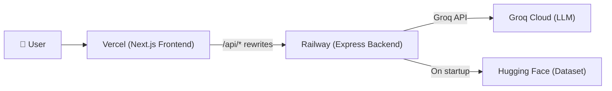

# Deployment Plan — Zomato AI Recommendations

> **Backend → Railway** (Express + Node.js)
> **Frontend → Vercel** (Next.js 16)

---

## Architecture Overview



The frontend proxies all `/api/*` requests to the Railway backend URL via Next.js rewrites — no CORS issues, no exposed backend URL to the client.

---

## Pre-Deployment Checklist

- [ ] Railway account created (https://railway.app)
- [ ] Vercel account created (https://vercel.com)
- [ ] GitHub repo pushed with latest code
- [ ] Groq API key ready (from https://console.groq.com)

---

## Part 1 — Backend Deployment (Railway)

### 1.1 Code Changes Required

#### [MODIFY] `backend/package.json`

Add a `start` script (already exists ✅) and ensure the `engines` field is set:

```json
{
  "engines": {
    "node": ">=18.0.0"
  },
  "scripts": {
    "start": "node server.js"
  }
}
```

> **NOTE:** Both already exist in your `package.json` — no changes needed here.

#### [MODIFY] `backend/server.js`

Remove the static frontend-serving lines since the frontend will be on Vercel. These lines currently couple the backend to the frontend filesystem:

```diff
- // ── Static file serving (frontend) ────────────────────────────────────
- app.use(express.static(path.join(__dirname, "..", "frontend")));

  // ... (keep all /api routes as-is) ...

- // Fallback: serve frontend index.html for non-API routes (SPA support)
- app.get("{*path}", (req, res) => {
-   res.sendFile(path.join(__dirname, "..", "frontend", "index.html"));
- });
```

Update the CORS config to lock down to the Vercel frontend URL:

```diff
- app.use(cors());
+ app.use(cors({
+   origin: process.env.FRONTEND_URL || "*",
+   methods: ["GET", "POST"],
+ }));
```

#### [NEW] `backend/.gitignore` (if not present at backend level)

Ensure these are ignored:

```
node_modules/
.env
data/zomato.json
```

> **IMPORTANT:** The `data/zomato.json` cache file is **~11 MB** and should NOT be committed. The backend auto-downloads it from Hugging Face on first startup. Railway's ephemeral filesystem will re-download on each deploy, which is acceptable for a dataset that rarely changes.

### 1.2 Railway Setup — Step by Step

1. **Create a new project** on railway.app
2. **Connect your GitHub repo**
3. **Set the Root Directory** to `backend` in **Settings → General → Root Directory**
4. **Configure Environment Variables** in **Settings → Variables**:

| Variable | Value | Notes |
|---|---|---|
| `GROQ_API_KEY` | `gsk_xxxxx...` | Your Groq API key |
| `PORT` | `3000` | Railway auto-assigns, but explicit is safer |
| `FRONTEND_URL` | `https://your-app.vercel.app` | Set after Vercel deploy |
| `NODE_ENV` | `production` | Standard Node.js env |

5. **Deploy** — Railway will:
   - Detect `package.json` → install deps with `npm install`
   - Run `npm start` → executes `node server.js`
   - On startup, `dataLoader.js` will download and cache the dataset from Hugging Face

6. **Copy the Railway public URL** (e.g., `https://zomato-backend-production.up.railway.app`)

> **WARNING:** First deploy takes 30–60 seconds extra because the server downloads ~11 MB of CSV data from Hugging Face, parses it, and builds the in-memory index. Subsequent requests are instant since data is cached in `data/zomato.json`. However, Railway uses an ephemeral filesystem — the cache is lost on each redeploy.

### 1.3 Railway Configuration Notes

| Setting | Value |
|---|---|
| **Builder** | Nixpacks (auto-detected) |
| **Start Command** | `npm start` (auto-detected from `package.json`) |
| **Root Directory** | `backend` |
| **Health Check** | `GET /api/health` (optional, configure in settings) |
| **Region** | Choose closest to your users |

---

## Part 2 — Frontend Deployment (Vercel)

### 2.1 Code Changes Required

#### [MODIFY] `frontend/next.config.ts`

Update the rewrite destination to point to the Railway backend URL:

```diff
  import type { NextConfig } from "next";

  const nextConfig: NextConfig = {
    async rewrites() {
      return [
        {
          source: "/api/:path*",
-         destination: "http://localhost:3000/api/:path*",
+         destination: `${process.env.NEXT_PUBLIC_API_URL || "http://localhost:3000"}/api/:path*`,
        },
      ];
    },
  };

  export default nextConfig;
```

#### `frontend/lib/api.ts` — No Changes Needed ✅

The frontend already uses relative `/api` paths which will be rewritten by Next.js:

```typescript
const API_BASE = "/api"; // ✅ This works perfectly with rewrites
```

#### [NEW] `frontend/.env.local` (for local dev only, do NOT commit)

```env
NEXT_PUBLIC_API_URL=http://localhost:3000
```

### 2.2 Vercel Setup — Step by Step

1. **Import your GitHub repo** on vercel.com/new
2. **Set the Root Directory** to `frontend`
3. **Framework Preset** will auto-detect as **Next.js**
4. **Configure Environment Variables**:

| Variable | Value | Notes |
|---|---|---|
| `NEXT_PUBLIC_API_URL` | `https://zomato-backend-production.up.railway.app` | Your Railway URL (no trailing slash) |

5. **Deploy** — Vercel will:
   - Install deps with `npm install`
   - Run `next build`
   - Deploy to the edge CDN

6. **Copy the Vercel URL** (e.g., `https://zomato-ai.vercel.app`)
7. **Go back to Railway** and set `FRONTEND_URL` to this Vercel URL

### 2.3 Vercel Configuration Notes

| Setting | Value |
|---|---|
| **Framework** | Next.js (auto-detected) |
| **Build Command** | `next build` (auto-detected) |
| **Output Directory** | `.next` (auto-detected) |
| **Root Directory** | `frontend` |
| **Node.js Version** | 18.x or 20.x |

---

## Part 3 — Post-Deployment Verification

### 3.1 Health Check

```bash
# Backend health
curl https://your-railway-url.up.railway.app/api/health

# Expected response:
# { "status": "ok", "timestamp": "2026-08-17T..." }
```

### 3.2 API Endpoints Test

```bash
# Cities
curl https://your-railway-url.up.railway.app/api/cities

# Locations
curl https://your-railway-url.up.railway.app/api/locations?city=bangalore

# Cuisines
curl https://your-railway-url.up.railway.app/api/cuisines

# Recommendations
curl -X POST https://your-railway-url.up.railway.app/api/recommend \
  -H "Content-Type: application/json" \
  -d '{"location":"bangalore","budget":"Medium","cuisine":"North Indian"}'
```

### 3.3 Frontend Verification

1. Open `https://your-app.vercel.app`
2. Verify the preference form loads city/location/cuisine dropdowns (confirms API connectivity)
3. Submit a recommendation request and verify results appear
4. Check browser DevTools Network tab — API calls should go to `/api/*` (rewritten to Railway)

---

## Part 4 — Configuration Summary

### Environment Variables Matrix

| Variable | Where | Value |
|---|---|---|
| `GROQ_API_KEY` | Railway | Your Groq API key |
| `PORT` | Railway | `3000` |
| `FRONTEND_URL` | Railway | `https://your-app.vercel.app` |
| `NODE_ENV` | Railway | `production` |
| `NEXT_PUBLIC_API_URL` | Vercel | `https://your-railway-url.up.railway.app` |

### Files to Modify (Summary)

| File | Change | Purpose |
|---|---|---|
| [`server.js`](file:///Users/shree/Desktop/Next%20Leap%20Prodman/Google%20Antigravity/Zomato%20Project/backend/server.js) | Remove static file serving, update CORS | Decouple from frontend filesystem |
| [`next.config.ts`](file:///Users/shree/Desktop/Next%20Leap%20Prodman/Google%20Antigravity/Zomato%20Project/frontend/next.config.ts) | Use env var for rewrite destination | Point to Railway URL in production |

---

## Part 5 — Cost & Limits

### Railway (Backend)

| Plan | Price | RAM | Notes |
|---|---|---|---|
| **Trial** | Free ($5 credit) | 512 MB | Good for testing |
| **Hobby** | $5/month | 8 GB | Sufficient for this app |
| **Pro** | $20/month | 32 GB | If you need more headroom |

> **TIP:** The in-memory restaurant dataset (~11 MB JSON, ~30 MB parsed) fits comfortably within Railway's Hobby plan RAM. The Groq API calls are lightweight outbound HTTP requests.

### Vercel (Frontend)

| Plan | Price | Notes |
|---|---|---|
| **Hobby** | Free | 100 GB bandwidth, perfect for this app |
| **Pro** | $20/month | Custom domains, team features |

---

## Part 6 — Optional Improvements

### 6.1 Custom Domains

- **Vercel**: Settings → Domains → Add `zomato-ai.yourdomain.com`
- **Railway**: Settings → Networking → Add custom domain for API

### 6.2 Persistent Data Cache (Railway)

If you want to avoid re-downloading the dataset on every deploy:

- Attach a **Railway Volume** to `/app/data` to persist `zomato.json` across deploys
- Or pre-commit the `zomato.json` file to the repo (adds ~11 MB to repo size)

### 6.3 Production CORS Lockdown

After confirming your Vercel URL, hardcode it in Railway's `FRONTEND_URL` environment variable. The updated `server.js` CORS config will only allow requests from your frontend.

### 6.4 Monitoring

- **Railway**: Built-in logging via `railway logs`
- **Vercel**: Built-in analytics and function logs in dashboard
- **Uptime**: Use UptimeRobot (https://uptimerobot.com) to ping `/api/health` every 5 min

---

## Deployment Sequence (TL;DR)

```
1. Make code changes (server.js CORS + next.config.ts rewrite)
2. Push to GitHub
3. Deploy backend on Railway (set env vars, get URL)
4. Deploy frontend on Vercel (set NEXT_PUBLIC_API_URL to Railway URL)
5. Go back to Railway → set FRONTEND_URL to Vercel URL
6. Test end-to-end
```
