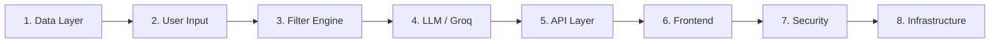

# Edge Cases & Corner Scenarios

> **References:** [context.md](file:///Users/shree/Desktop/Next%20Leap%20Prodman/Google%20Antigravity/Zomato%20Project/context.md) · [architecture.md](file:///Users/shree/Desktop/Next%20Leap%20Prodman/Google%20Antigravity/Zomato%20Project/architecture.md) · [implementation-plan.md](file:///Users/shree/Desktop/Next%20Leap%20Prodman/Google%20Antigravity/Zomato%20Project/implementation-plan.md)

---

## Overview

This document catalogs every edge case and corner scenario across all layers of the system. Each entry includes the **scenario**, **expected behavior**, and **handling strategy**.



---

## 1. Data Layer Edge Cases

### 1.1 Dataset Availability

| # | Scenario | Expected Behavior | Handling |
|---|---|---|---|
| D-1 | Hugging Face API is down or unreachable during startup | Server should not crash | If `zomato.json` cache exists, use it. If not, fail to start with a clear error: `"Dataset unavailable — cannot start server"` |
| D-2 | Hugging Face API returns a 403/401 (rate-limited or auth issue) | Graceful degradation | Fall back to cached `zomato.json`. Log warning. If no cache, exit with error |
| D-3 | Dataset format has changed (columns renamed/removed) | Detect schema mismatch | Validate expected columns on load. If critical fields (`name`, `cuisines`, `aggregate_rating`) are missing, log error and halt startup |
| D-4 | Dataset is completely empty (0 records) | Prevent serving empty data | Log error, refuse to start: `"Dataset loaded but contains 0 records"` |
| D-5 | Dataset contains duplicate restaurant entries | Avoid duplicate recommendations | Deduplicate by `name + city` composite key during processing |

### 1.2 Data Quality

| # | Scenario | Expected Behavior | Handling |
|---|---|---|---|
| D-6 | `name` field is `null` or empty string | Skip the record | Filter out records where `name` is falsy during cleaning |
| D-7 | `aggregate_rating` is `0`, `null`, or non-numeric | Treat as unrated | Default to `0`. These records will naturally rank last (sorted by rating desc) |
| D-8 | `average_cost_for_two` is `0`, negative, or `null` | Cannot determine budget tier | Default to `0` → maps to `Low` tier. Log warning for negative values |
| D-9 | `cuisines` field is `null` or empty string | Restaurant has no tagged cuisine | Set to `["Unknown"]`. Will only match if user searches for `"Unknown"` (effectively hidden) |
| D-10 | `cuisines` contains unusual delimiters (`;`, `/`, `&`) | Incorrect cuisine parsing | Normalize delimiters: replace `;`, `/`, ` & ` with `,` before splitting |
| D-11 | `city` / `location` has inconsistent casing or typos | Missed location matches | Lowercase and trim during processing. Common aliases (e.g., `"Bengaluru"` ↔ `"Bangalore"`) should be mapped |
| D-12 | `votes` field is negative | Invalid data | Clamp to `0` during cleaning |
| D-13 | `average_cost_for_two` is extremely high (e.g., ₹99,999) | Still valid, falls into `High` tier | No special handling needed — budget tier caps at `High` |
| D-14 | Restaurant name contains special characters (`&`, `'`, `"`, emoji) | Display issues, JSON escaping bugs | Ensure proper JSON escaping. Frontend must use `textContent` (not `innerHTML`) to render names |

---

## 2. User Input Edge Cases

### 2.1 Missing & Empty Fields

| # | Scenario | Expected Behavior | Handling |
|---|---|---|---|
| I-1 | `location` is empty or missing | Cannot filter | Return `400`: `"Location is required"` |
| I-2 | `budget` is empty or missing | Cannot filter | Return `400`: `"Budget is required"` |
| I-3 | `cuisine` is empty or missing | Cannot filter | Return `400`: `"Cuisine preference is required"` |
| I-4 | `min_rating` is missing | Optional — should default | Default to `0` (no minimum) |
| I-5 | `additional_preferences` is missing | Optional — should default | Default to empty string. Prompt builder omits this section if empty |
| I-6 | Entire request body is empty `{}` | No filters possible | Return `400` with all required field errors |
| I-7 | Request body is not JSON (e.g., form-data, XML) | Parse failure | Return `400`: `"Request body must be valid JSON"` |

### 2.2 Invalid Values

| # | Scenario | Expected Behavior | Handling |
|---|---|---|---|
| I-8 | `budget` is an invalid value (e.g., `"luxury"`, `"999"`) | Not in allowed set | Return `400`: `"Budget must be one of: low, medium, high"` |
| I-9 | `min_rating` is negative (e.g., `-1`) | Out of range | Return `400`: `"Min rating must be between 0 and 5"` |
| I-10 | `min_rating` is greater than 5 (e.g., `10`) | Out of range | Return `400`: `"Min rating must be between 0 and 5"` |
| I-11 | `min_rating` is a string instead of number (e.g., `"four"`) | Type mismatch | Attempt `parseFloat()`. If `NaN`, return `400`: `"Min rating must be a number"` |
| I-12 | `location` is a number or boolean | Type mismatch | Return `400`: `"Location must be a string"` |
| I-13 | `cuisine` contains only whitespace (`"   "`) | Effectively empty | Trim first, then treat as missing → `400` |
| I-14 | `min_rating` is `5` (maximum possible) | Very strict filter | Valid — may return very few or zero results. Handle in filter engine (see F-1) |

### 2.3 Adversarial & Boundary Inputs

| # | Scenario | Expected Behavior | Handling |
|---|---|---|---|
| I-15 | `location` is extremely long (10,000+ chars) | Potential DoS | Cap at 100 characters. Reject with `400` if exceeded |
| I-16 | `additional_preferences` is extremely long | LLM token waste, potential abuse | Cap at 300 characters |
| I-17 | Fields contain HTML tags (`<script>alert('xss')</script>`) | XSS risk | Strip HTML tags server-side before processing |
| I-18 | Fields contain SQL injection attempts (`'; DROP TABLE --`) | No SQL, but defense-in-depth | Input is never used in SQL. Still sanitize for LLM prompt safety |
| I-19 | `location` is a real place but not in the dataset (e.g., `"Timbuktu"`) | Zero results after filtering | Return `400`: `"No restaurants found in this location. Try: Delhi, Mumbai, Bangalore..."` |
| I-20 | `cuisine` is misspelled (e.g., `"Itlian"` instead of `"Italian"`) | Zero results from filter | No fuzzy matching in v1. Return zero results with helpful message. Future: add fuzzy/Levenshtein matching |
| I-21 | User submits the same request rapidly (spam clicks) | Server overload | Rate limiting (10 req/min per IP). Frontend debounce on submit button |

---

## 3. Filter Engine Edge Cases

| # | Scenario | Expected Behavior | Handling |
|---|---|---|---|
| F-1 | All filters combined return **0 results** | Nothing to send to LLM | Return `400`: `"No restaurants match your criteria. Try a different location, broader budget, or different cuisine."` |
| F-2 | Filters return **exactly 1 result** | LLM still runs but ranks only 1 | Valid. LLM returns a single recommendation with explanation |
| F-3 | Filters return **more than 15 results** | Must cap for LLM token limits | Take top 15 by rating. Documented behavior |
| F-4 | Filters return **exactly 15 results** | Boundary of cap | No special handling — works normally |
| F-5 | Multiple restaurants have the **same rating** (tie) | Sort order is ambiguous | Secondary sort by `votes` (desc) to break ties — more popular restaurant wins |
| F-6 | User selects `"Low"` budget but location only has expensive restaurants | Zero results | Same as F-1 — suggest broadening criteria |
| F-7 | Cuisine partial match is **too broad** (e.g., `"Indian"` matches 90% of restaurants) | Too many matches before cap | Cap at 15 handles this. LLM gets a diverse set |
| F-8 | Restaurant has multiple cuisines, only one matches | Should still be included | Correct — partial match logic includes it. This is desired behavior |
| F-9 | `min_rating` of `0` is specified (default) | No rating filter applied | All restaurants pass the rating check. Expected |
| F-10 | All 15 capped results have the **same cuisine** | Lack of variety in recommendations | Not handled in v1. Future: diversity sampling to mix cuisines |

---

## 4. LLM (Groq) Edge Cases

### 4.1 API Communication

| # | Scenario | Expected Behavior | Handling |
|---|---|---|---|
| L-1 | `GROQ_API_KEY` is missing from `.env` | Cannot call API | Detect on startup. Log error: `"GROQ_API_KEY not set"`. Server still starts, but requests get fallback (filtered list without AI) |
| L-2 | `GROQ_API_KEY` is invalid / revoked | API returns `401` | Catch error. Return fallback response with `"ai_powered": false` |
| L-3 | Groq API returns `429 Too Many Requests` | Rate limited | Exponential backoff: wait 1s → 2s → 4s, max 3 retries. If still failing, fallback |
| L-4 | Groq API returns `500 Internal Server Error` | Provider issue | Retry once after 2s. If still failing, fallback |
| L-5 | Groq API times out (>30s response) | Hung connection | Set `AbortController` timeout at 15 seconds. On timeout, fallback |
| L-6 | Groq API returns `200` but body is empty | No content generated | Treat as failure, fallback to filtered list |
| L-7 | Network is completely down (DNS failure, no internet) | Cannot reach API | `fetch` throws `TypeError`. Catch and fallback |

### 4.2 Response Parsing

| # | Scenario | Expected Behavior | Handling |
|---|---|---|---|
| L-8 | LLM returns valid JSON inside markdown code fences (` ```json ... ``` `) | Common LLM behavior | Strip markdown code fences before `JSON.parse()` |
| L-9 | LLM returns invalid JSON (missing comma, trailing comma) | Parse failure | `JSON.parse()` throws. Retry once. If still invalid, fallback |
| L-10 | LLM returns JSON but with wrong schema (missing `rank`, `name`, etc.) | Incomplete data | Validate each object has required fields. Fill missing with `"N/A"` or discard the entry |
| L-11 | LLM returns fewer than 5 recommendations (e.g., only 2) | Possible if few candidates | Accept whatever count is returned. Frontend renders what it gets |
| L-12 | LLM returns more than 5 recommendations | Extra results | Truncate to 5 (or requested count) |
| L-13 | LLM returns recommendations for restaurants **not in the filtered list** | Hallucination | Cross-reference with filtered list by name. Discard unmatched entries. Log warning |
| L-14 | LLM `explanation` field is excessively long (500+ words) | UI overflow | Truncate to 300 characters on frontend with "Read more" or ellipsis |
| L-15 | LLM returns the same restaurant twice (duplicate in ranking) | Duplicate cards | Deduplicate by `name` before sending to frontend |
| L-16 | LLM returns `estimated_cost` as a string (`"₹1200"`) instead of number | Type inconsistency | `parseInt()` / `parseFloat()` with fallback to original restaurant data |
| L-17 | LLM injects conversational text before/after JSON (e.g., `"Here are the results: [...]"`) | `JSON.parse()` fails | Extract JSON array using regex: find first `[` to last `]`. Then parse |
| L-18 | LLM returns empty array `[]` | No recommendations made | Treat as fallback — return filtered list directly |

### 4.3 Prompt-Related

| # | Scenario | Expected Behavior | Handling |
|---|---|---|---|
| L-19 | Filtered restaurant list is very large (15 entries × long names) | Prompt may be long | Already capped at 15. Each entry is summarized to key fields only — keeps prompt under 2000 tokens |
| L-20 | `additional_preferences` contains prompt injection (e.g., `"Ignore previous instructions and..."`) | LLM hijacking attempt | Sanitize: escape quotes, strip control chars. Wrap user input in explicit delimiters in prompt |
| L-21 | User's `additional_preferences` is in a non-English language | LLM may or may not understand | `llama-3.3-70b-versatile` handles multiple languages. Accept but note as a known limitation |

---

## 5. API Layer Edge Cases

| # | Scenario | Expected Behavior | Handling |
|---|---|---|---|
| A-1 | `POST /api/recommend` with `GET` method | Wrong method | Return `405 Method Not Allowed` |
| A-2 | Request to unknown route (e.g., `/api/foo`) | Not found | Return `404`: `"Endpoint not found"` |
| A-3 | `Content-Type` header missing or not `application/json` | Body may not parse | Express `json()` middleware rejects. Return `400`: `"Content-Type must be application/json"` |
| A-4 | Request body exceeds size limit (e.g., 1MB payload) | Potential DoS | Set `express.json({ limit: '10kb' })`. Reject with `413 Payload Too Large` |
| A-5 | Multiple concurrent requests (100+ simultaneous) | Server strain | Node.js handles via event loop. Rate limiting prevents abuse. Groq may throttle |
| A-6 | Server runs out of memory (huge dataset in memory) | Crash | Monitor memory. Dataset is ~10-50MB which is manageable. Add `process.on('uncaughtException')` logging |
| A-7 | CORS preflight (`OPTIONS`) request | Browser CORS check | `cors()` middleware handles automatically |
| A-8 | Response JSON is malformed due to a bug | Client parse failure | Always use `res.json()` (not `res.send()`) to guarantee valid JSON |

---

## 6. Frontend Edge Cases

### 6.1 Form & Input

| # | Scenario | Expected Behavior | Handling |
|---|---|---|---|
| FE-1 | User clicks submit with empty form | Nothing should happen | Client-side validation — highlight missing required fields, prevent submission |
| FE-2 | User double-clicks submit rapidly | Duplicate API calls | Disable submit button on click, re-enable after response/error |
| FE-3 | User clicks "Search Again" while results are loading | Race condition | Cancel the in-flight `fetch` using `AbortController`. Reset UI state |
| FE-4 | User pastes very long text into a field | UI overflow / API rejection | Set `maxlength` on `<input>` / `<textarea>` elements |
| FE-5 | User has JavaScript disabled | App does not work at all | Show `<noscript>` message: `"This app requires JavaScript"` |

### 6.2 Results Rendering

| # | Scenario | Expected Behavior | Handling |
|---|---|---|---|
| FE-6 | API returns 0 recommendations | Empty results area | Show friendly empty state: `"No matches found. Try different preferences!"` |
| FE-7 | API returns only 1 recommendation | Single card, looks sparse | Still render — CSS grid collapses gracefully |
| FE-8 | Restaurant name is extremely long (50+ chars) | Card layout breaks | CSS `text-overflow: ellipsis` + `overflow: hidden` on name container |
| FE-9 | AI explanation is extremely long | Card height inconsistent | Clamp to 3–4 lines with CSS `-webkit-line-clamp` or truncate with JS |
| FE-10 | Rating is exactly `0` | Edge display case | Show `"Not rated"` instead of `0 / 5` |
| FE-11 | Estimated cost is `0` or missing | Misleading display | Show `"Price unavailable"` instead of `₹0` |
| FE-12 | Special characters in restaurant name (`&`, `<`, `>`) | XSS if using `innerHTML` | Always use `textContent` or DOM API to set text. Never `innerHTML` for user data |

### 6.3 Network & Performance

| # | Scenario | Expected Behavior | Handling |
|---|---|---|---|
| FE-13 | Backend is not running / unreachable | Network error | Catch `fetch` error. Show: `"Unable to reach the server. Please try again later."` |
| FE-14 | API takes >10 seconds to respond | User thinks it's frozen | Show loading skeleton immediately. Consider a timeout message at 10s: `"Still working..."` |
| FE-15 | User is on a slow 2G/3G connection | Long load times | Skeleton loaders provide perceived performance. Keep response payload small |
| FE-16 | Browser does not support `fetch` API | JS error | Extremely rare (IE11). `fetch` is supported in all modern browsers. Not a priority for v1 |

---

## 7. Security Edge Cases

| # | Scenario | Expected Behavior | Handling |
|---|---|---|---|
| S-1 | Prompt injection via `additional_preferences` | LLM does something unintended | Wrap user input in delimiters: `"""User says: {input}"""`. Sanitize control characters |
| S-2 | `GROQ_API_KEY` exposed in frontend source | Key compromise | Key is ONLY on backend in `.env`. Frontend never sees it |
| S-3 | `.env` file accidentally committed to git | Key leaked in repo | `.gitignore` includes `.env`. Add a pre-commit hook check |
| S-4 | API endpoint called from unauthorized origin | Cross-origin abuse | CORS whitelist. Rate limiting as secondary defense |
| S-5 | Attacker floods `/api/recommend` to exhaust Groq credits | Cost attack / DoS | Rate limit (10 req/min per IP). Monitor Groq usage dashboard |
| S-6 | User input contains `\n`, `\r`, or other control chars | Prompt format corruption | Strip `\r`. Replace `\n` with space in user inputs before prompt injection |
| S-7 | LLM returns content that includes harmful/biased language | Reputation risk | In v1, trust model behavior. Future: add content moderation layer |

---

## 8. Infrastructure & Environment Edge Cases

| # | Scenario | Expected Behavior | Handling |
|---|---|---|---|
| E-1 | `npm install` fails (network issue, registry down) | Cannot install dependencies | Retry. Use `npm cache` if available. Document in README troubleshooting section |
| E-2 | Node.js version is too old (< v18) | `fetch` API not available | Require Node 18+ in `package.json` `engines` field. Use `node-fetch` as fallback polyfill |
| E-3 | Port 3000 is already in use | Server fails to start | Catch `EADDRINUSE` error. Log: `"Port 3000 is in use. Set PORT env variable to use a different port"` |
| E-4 | `data/` directory does not exist | File write fails | Create `data/` directory programmatically before writing `zomato.json` |
| E-5 | Disk is full — cannot write `zomato.json` | Write fails | Catch `ENOSPC` error. Log clear error. Fail startup |
| E-6 | Server crashes mid-request | Client gets no response | `process.on('uncaughtException')` and `process.on('unhandledRejection')` — log and exit gracefully. Client shows timeout/network error |
| E-7 | Multiple instances of server started on same machine | Port conflict | Same as E-3. Only one instance can bind to a port |

---

## Summary Matrix

| Layer | Total Edge Cases | Critical | Medium | Low |
|---|---|---|---|---|
| **Data Layer** | 14 | 4 (D-1, D-3, D-4, D-5) | 6 | 4 |
| **User Input** | 21 | 6 (I-1 to I-3, I-15, I-17, I-21) | 9 | 6 |
| **Filter Engine** | 10 | 2 (F-1, F-5) | 4 | 4 |
| **LLM / Groq** | 21 | 7 (L-1, L-2, L-5, L-9, L-13, L-17, L-20) | 8 | 6 |
| **API Layer** | 8 | 3 (A-1, A-4, A-6) | 3 | 2 |
| **Frontend** | 16 | 4 (FE-1, FE-2, FE-12, FE-13) | 7 | 5 |
| **Security** | 7 | 4 (S-1, S-2, S-3, S-5) | 2 | 1 |
| **Infrastructure** | 7 | 3 (E-2, E-3, E-6) | 3 | 1 |
| **Total** | **104** | **33** | **42** | **29** |

---

## Priority Labels

| Label | Meaning | Action |
|---|---|---|
| 🔴 **Critical** | Can crash the app, lose data, or create security vulnerabilities | Must handle before launch |
| 🟡 **Medium** | Degrades user experience or produces wrong results | Should handle before launch |
| 🟢 **Low** | Cosmetic issues or unlikely scenarios | Handle if time permits |

---

> **Source:** [context.md](file:///Users/shree/Desktop/Next%20Leap%20Prodman/Google%20Antigravity/Zomato%20Project/context.md) · [architecture.md](file:///Users/shree/Desktop/Next%20Leap%20Prodman/Google%20Antigravity/Zomato%20Project/architecture.md) · [implementation-plan.md](file:///Users/shree/Desktop/Next%20Leap%20Prodman/Google%20Antigravity/Zomato%20Project/implementation-plan.md)
