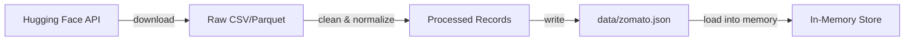
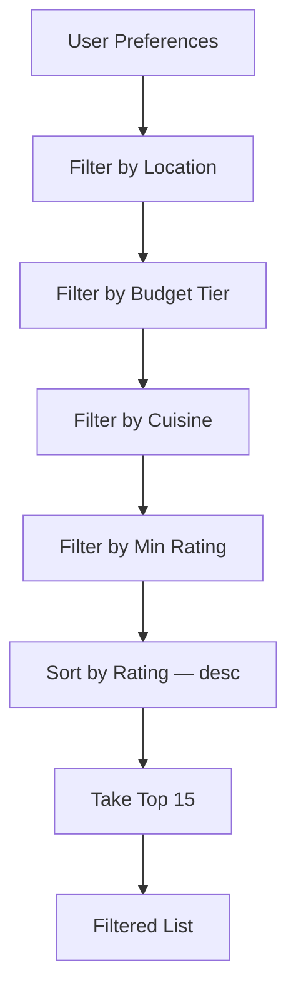
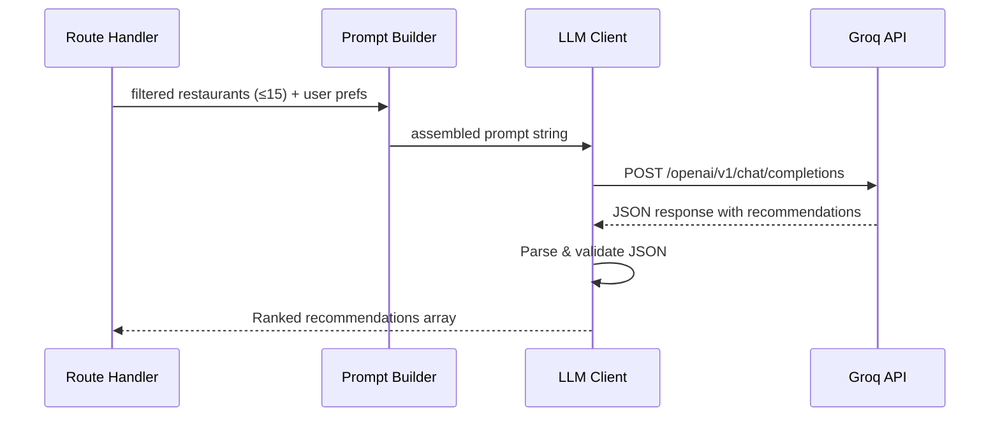

# Implementation Plan: AI-Powered Restaurant Recommendation System

> **References:** [context.md](file:///Users/shree/Desktop/Next%20Leap%20Prodman/Google%20Antigravity/Zomato%20Project/context.md) · [architecture.md](file:///Users/shree/Desktop/Next%20Leap%20Prodman/Google%20Antigravity/Zomato%20Project/architecture.md)

---

## Phase Overview

```mermaid
gantt
    title Implementation Phases
    dateFormat  X
    axisFormat %s

    section Phase 1
    Project Setup & Data Layer          :p1, 0, 1
    section Phase 2
    Backend — API & Filter Engine       :p2, 1, 2
    section Phase 3
    LLM Integration (Groq)              :p3, 2, 3
    section Phase 4
    Frontend — UI & Integration         :p4, 3, 4
    section Phase 5
    Polish, Error Handling & Deployment  :p5, 4, 5
```



Each phase produces a **working, testable deliverable** before moving to the next.

---

## Phase 1 — Project Setup & Data Layer

> **Goal:** Bootstrap the project structure, fetch the Zomato dataset, and build the data processing pipeline.

### 1.1 Project Scaffolding

| Task | Detail |
|---|---|
| Create directory structure | Match the layout defined in [architecture.md §5](file:///Users/shree/Desktop/Next%20Leap%20Prodman/Google%20Antigravity/Zomato%20Project/architecture.md) |
| Initialize backend | `npm init -y` inside `backend/`, install `express`, `dotenv`, `cors` |
| Create `.env` | Add placeholder `GROQ_API_KEY=your_key_here` |
| Add `.gitignore` | Ignore `node_modules/`, `.env`, `backend/data/zomato.json` |

**Files created:**

```
Zomato Project/
├── backend/
│   ├── package.json
│   ├── .env
│   └── .gitignore
├── frontend/           # empty placeholder dirs
│   ├── css/
│   └── js/
└── README.md
```

### 1.2 Data Loader (`dataLoader.js`)

| Task | Detail |
|---|---|
| Fetch dataset | Download from [Hugging Face API](https://huggingface.co/datasets/ManikaSaini/zomato-restaurant-recommendation) using `fetch` / `node-fetch` |
| Clean & normalize | Handle missing values, lowercase cities, trim whitespace |
| Normalize cost | Map `average_cost_for_two` → budget tiers: `Low` (≤₹500), `Medium` (₹500–₹1500), `High` (>₹1500) |
| Parse cuisines | Split comma-separated strings into arrays |
| Cache locally | Write processed data to `backend/data/zomato.json` |
| In-memory index | Load JSON into memory on server startup, index by city |

**Data flow:**



### 1.3 Verification

- [ ] `node backend/services/dataLoader.js` runs without errors
- [ ] `backend/data/zomato.json` is created with valid data
- [ ] Console logs record count and sample record

---

## Phase 2 — Backend: API & Filter Engine

> **Goal:** Stand up the Express server, implement input validation, and build the filter engine.

### 2.1 Express Server (`server.js`)

| Task | Detail |
|---|---|
| Setup Express app | CORS, JSON body parsing, port `3000` |
| Mount routes | `POST /api/recommend` → `routes/recommend.js` |
| Load data on startup | Call `dataLoader.loadData()` before listening |
| Health check | `GET /api/health` → `{ "status": "ok" }` |

### 2.2 Input Validator (`validators.js`)

| Field | Validation Rule |
|---|---|
| `location` | Required, string, max 100 chars, trimmed |
| `budget` | Required, one of `["low", "medium", "high"]` |
| `cuisine` | Required, string, max 100 chars |
| `min_rating` | Optional, number between 0–5, default `0` |
| `additional_preferences` | Optional, string, max 300 chars |

### 2.3 Filter Engine (`filterEngine.js`)

Implements the chained filter pipeline from [architecture.md §2.4](file:///Users/shree/Desktop/Next%20Leap%20Prodman/Google%20Antigravity/Zomato%20Project/architecture.md):



| Filter | Logic |
|---|---|
| Location | Case-insensitive match on `city` |
| Budget | Map user tier to cost range, compare `average_cost_for_two` |
| Cuisine | Partial match — any cuisine in the restaurant's array overlaps |
| Min Rating | `aggregate_rating >= min_rating` |
| Cap | Top 15 results sorted by rating descending |

### 2.4 Route Handler (`recommend.js`)

Temporary implementation (Groq integration comes in Phase 3):

1. Validate input → return `400` on failure
2. Run filter engine → return `400` if zero matches
3. Return filtered list directly as the response (without LLM ranking)

### 2.5 Verification

- [ ] `npm start` boots server on port 3000
- [ ] `GET /api/health` returns `200`
- [ ] `POST /api/recommend` with valid body returns filtered restaurants
- [ ] `POST /api/recommend` with invalid body returns `400` with errors
- [ ] Edge case: no matching restaurants returns helpful message

---

## Phase 3 — LLM Integration (Groq)

> **Goal:** Connect to Groq API, build the prompt template, parse structured JSON responses, and add fallback handling.

### 3.1 Prompt Builder (`promptBuilder.js`)

| Task | Detail |
|---|---|
| Build prompt template | Use the template from [architecture.md §2.5](file:///Users/shree/Desktop/Next%20Leap%20Prodman/Google%20Antigravity/Zomato%20Project/architecture.md) |
| Format restaurant list | Convert filtered array into a readable numbered list with key fields |
| Inject user preferences | Interpolate location, budget, cuisine, min_rating, additional_preferences |
| Enforce JSON output | Prompt explicitly asks for valid JSON array |

### 3.2 LLM Client (`llmClient.js`)

| Aspect | Detail |
|---|---|
| **Provider** | Groq |
| **Model** | `llama-3.3-70b-versatile` |
| **Endpoint** | `https://api.groq.com/openai/v1/chat/completions` |
| **Auth** | `Authorization: Bearer ${GROQ_API_KEY}` |
| **Request format** | OpenAI-compatible chat completions (system + user messages) |
| **Response parsing** | Extract `choices[0].message.content`, parse as JSON |
| **Temperature** | `0.3` — low for consistent, deterministic recommendations |

**Request flow:**



### 3.3 Integrate into Route Handler

Update `routes/recommend.js`:

1. Validate input
2. Filter dataset
3. Build prompt → call Groq → parse response
4. Return structured response:

```json
{
  "success": true,
  "count": 5,
  "recommendations": [ ... ]
}
```

### 3.4 Fallback & Retry Logic

| Scenario | Handling |
|---|---|
| Groq API returns non-200 | Retry once with exponential backoff |
| Response is not valid JSON | Retry once; if still invalid, return raw filtered data |
| Groq API is unreachable | Return filtered list without AI explanations (`"ai_powered": false`) |
| Rate limited (429) | Exponential backoff, max 3 retries |

### 3.5 Verification

- [ ] `POST /api/recommend` returns AI-ranked recommendations with explanations
- [ ] Response matches the API contract from [architecture.md §3](file:///Users/shree/Desktop/Next%20Leap%20Prodman/Google%20Antigravity/Zomato%20Project/architecture.md)
- [ ] Removing `GROQ_API_KEY` triggers fallback (returns filtered list, no crash)
- [ ] Invalid Groq responses trigger retry then fallback

---

## Phase 4 — Frontend: Next.js UI & Integration

> **Goal:** Build a premium dark-themed Next.js app with TypeScript, Tailwind CSS, glassmorphism cards, and micro-animations. Connect to the Express backend via API proxy.

### 4.1 Scaffold Next.js Project

| Task | Detail |
|---|---|
| Scaffold | `npx -y create-next-app@latest ./frontend --app --ts --tailwind --use-npm --disable-git` |
| Port | `3001` (dev), proxies `/api/*` to Express on `3000` |
| Config | `next.config.ts` with `rewrites()` for API proxy |

### 4.2 Design System (`globals.css` + Tailwind)

| Element | Specification |
|---|---|
| **Theme** | Dark gradient background (`#0a0a0f` → `#111128`), noise texture overlay |
| **Typography** | Google Fonts `Inter` via `next/font` (zero layout shift) |
| **Cards** | Glassmorphism — `backdrop-blur-xl`, `bg-white/[0.03]`, subtle borders |
| **Colors** | Deep purples, warm ambers, cool teals, emerald status indicators |
| **Animations** | Fade-in-up, shimmer skeletons, floating illustration, orbiting dots |
| **Custom CSS** | `.glass-card`, `.form-input`, `.skeleton`, custom scrollbar |

### 4.3 Components

| Component | Purpose |
|---|---|
| `Header.tsx` | Fixed header, scroll-reactive glassmorphism backdrop, Groq status dot |
| `PreferenceForm.tsx` | 5-field form: text inputs, budget toggle buttons, rating slider, validation |
| `RecommendationCard.tsx` | Glassmorphism card: rank badge, color-coded rating, cuisine tags, cost, AI insight |
| `CardGrid.tsx` | Responsive 1→2→3 column grid with result count + AI status badge |
| `LoadingSkeleton.tsx` | 5 shimmer skeleton cards matching exact card layout |
| `ErrorState.tsx` | Error display with emoji, message, and retry button |
| `EmptyState.tsx` | Decorative illustration with floating emoji + orbiting dots |
| `Footer.tsx` | Dataset attribution + Groq credit |

### 4.4 Logic Layer

| File | Purpose |
|---|---|
| `lib/types.ts` | TypeScript interfaces matching API contract (`UserPreferences`, `Recommendation`, `ApiResponse`) |
| `lib/api.ts` | Fetch wrapper — `POST /api/recommend` with 30s timeout + error handling |
| `hooks/useRecommendations.ts` | Custom hook managing `{ data, isLoading, error, aiPowered, hasSearched }` |

### 4.5 Page Assembly (`app/page.tsx`)

| Section | Detail |
|---|---|
| Hero | Gradient headline "Find Your Perfect Restaurant" |
| Form | `PreferenceForm` → calls `useRecommendations.fetchRecommendations()` |
| Results | Conditional: `LoadingSkeleton` → `CardGrid` → `ErrorState` → `EmptyState` |
| Reset | "Search Again" button calls `reset()` |

### 4.6 Verification

- [x] `next build` compiles with zero errors
- [x] Dev server starts on port 3001 (HTTP 200)
- [ ] Form collects all 5 preference fields with client-side validation
- [ ] Submit triggers loading skeleton with shimmer animation
- [ ] Recommendations render as glassmorphism cards with staggered entry
- [ ] Error states display correctly (no results, API failure, network error)
- [ ] Responsive layout works: 375px → 768px → 1440px
- [ ] "Search Again" resets the view

---

## Phase 5 — Polish, Error Handling & Deployment Readiness

> **Goal:** Harden the app with robust error handling, add finishing touches, and prepare for deployment.

### 5.1 Error Handling Hardening

| Scenario | Frontend | Backend |
|---|---|---|
| No matching restaurants | "No restaurants found — try broader criteria" message | `400` with helpful error |
| LLM failure | Show results with "(without AI insights)" badge | Fallback to filtered list |
| Network error | `ErrorState` with retry button | N/A |
| Invalid input | Inline validation before submit | `400` with field-specific errors |
| Server crash | `ErrorState` component | Graceful process error handlers |

### 5.2 Security Hardening

| Task | Detail |
|---|---|
| Sanitize inputs | Strip HTML, cap string lengths server-side |
| Prompt injection guard | Escape/quote user input before embedding in LLM prompt |
| CORS | Not needed — Next.js proxy makes it same-origin |
| Rate limiting | Add `express-rate-limit` on `/api/recommend` (e.g., 10 req/min) |
| `.env` protection | Verify `.gitignore` includes `.env` |

### 5.3 UX Polish (Already Built)

| Enhancement | Status |
|---|---|
| Micro-animations | ✅ Card stagger (100ms), hover lift + glow |
| Empty state | ✅ Floating emoji with orbiting dots |
| Loading skeleton | ✅ Shimmer matching card layout |
| Smooth transitions | ✅ Fade-in-up animations |
| SEO | ✅ Next.js `metadata` API: title, description, OG tags |

### 5.4 Running the App

| Service | Command | Port |
|---|---|---|
| Backend | `cd backend && npm start` | `3000` |
| Frontend | `cd frontend && npm run dev` | `3001` |
| Access | Open `http://localhost:3001` | — |

> API requests from the frontend are automatically proxied to `http://localhost:3000/api/*` via `next.config.ts` rewrites.

### 5.5 README.md

| Section | Content |
|---|---|
| Project overview | What it does, screenshot |
| Setup instructions | Clone, `npm install` in both dirs, add `.env`, start both servers |
| API documentation | Endpoint, request/response format |
| Tech stack | Updated table with Next.js + TypeScript + Tailwind |
| Architecture diagram | Embed mermaid or link to architecture.md |

### 5.6 Final Verification Checklist

- [ ] Full end-to-end flow works: form → loader → AI recommendations
- [ ] Fallback works when Groq key is missing/invalid
- [ ] Input validation catches all edge cases (empty fields, long strings, XSS)
- [ ] Rate limiting prevents abuse
- [ ] Responsive design verified at 375px, 768px, 1024px, 1440px
- [ ] No console errors in browser
- [ ] Server handles concurrent requests without crashing
- [ ] `.env` is not committed to git
- [ ] README is complete and accurate

---

## Phase Summary

| Phase | Deliverable | Key Files |
|---|---|---|
| **1** | Data pipeline running, dataset cached | `dataLoader.js`, `zomato.json` |
| **2** | Working API with filtering (no LLM) | `server.js`, `filterEngine.js`, `validators.js`, `recommend.js` |
| **3** | AI-powered recommendations via Groq | `promptBuilder.js`, `llmClient.js` |
| **4** | Premium Next.js frontend with full integration | `page.tsx`, `globals.css`, `PreferenceForm.tsx`, `RecommendationCard.tsx`, `useRecommendations.ts` |
| **5** | Production-ready app with error handling | Security, polish, README, deployment config |

---

> **Source:** [context.md](file:///Users/shree/Desktop/Next%20Leap%20Prodman/Google%20Antigravity/Zomato%20Project/context.md) · [architecture.md](file:///Users/shree/Desktop/Next%20Leap%20Prodman/Google%20Antigravity/Zomato%20Project/architecture.md)
